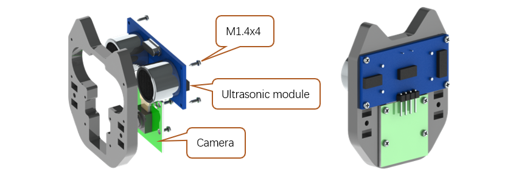
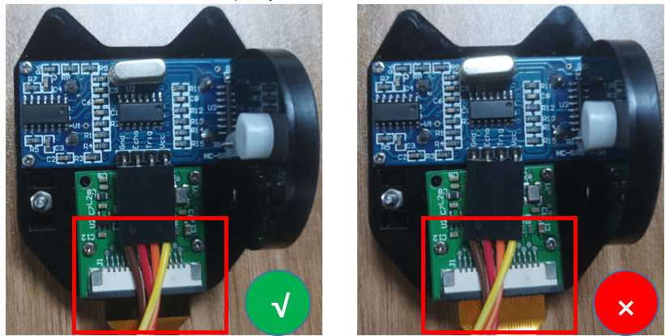

##############################################################################
Chapter 2 Assemble Robot
##############################################################################

If you have any concerns, please feel free to contact us at support@freenove.com

It is recommended to assemble and use the robot dog according to the tutorial. Otherwise, there may be installation errors, device damage, etc. 

:red:`Don't reverse batteries. Or the board will be damaged.`

Step 1 Install Disk Servo Arms
****************************************************************

Take out 12 disk servo arms from the servo packages. 

There are 4 pairs of opposite holes on the disk servo arm, and the distance between each pair is different. 

Please use the 2 pairs of holes with longer distance.

M1.2*7 screws are contained in following plastic bag. :red:`If a package of M1.2*7 self-tapping screws cannot be found, it may be packed in the servo package.`

|

.. image:: ../_static/imgs/Chapter_2_Assemble_Robot/Chapter2_04.png
    :align: center

Get following 4 parts.

|

|

.. image:: ../_static/imgs/Chapter_2_Assemble_Robot/Chapter2_07.png
    :align: center

Step 2 Install Body Bracket
****************************************************************

.. image:: ../_static/imgs/Chapter_2_Assemble_Robot/Chapter2_08.png
    :align: center

|

.. image:: ../_static/imgs/Chapter_2_Assemble_Robot/Chapter2_09.png
    :align: center

|

.. image:: ../_static/imgs/Chapter_2_Assemble_Robot/Chapter2_10.png
    :align: center

Step 3 Install Shield
****************************************************************

.. image:: ../_static/imgs/Chapter_2_Assemble_Robot/Chapter2_11.png
    :align: center

|

Step 4 Install MPU6050
****************************************************************

.. note:: 

    There are two rows of headers. Plug the MPU6050 into the outer Row. 

.. image:: ../_static/imgs/Chapter_2_Assemble_Robot/Chapter2_13.png
    :align: center

Step 5 Install LED module
****************************************************************

Install the top bracket.

.. image:: ../_static/imgs/Chapter_2_Assemble_Robot/Chapter2_15.png
    :align: center

Connect shield with LED module.

.. image:: ../_static/imgs/Chapter_2_Assemble_Robot/Chapter2_16.png
    :align: center

This step will be very helpful for later assembly.

.. image:: ../_static/imgs/Chapter_2_Assemble_Robot/Chapter2_17.png
    :align: center

Step 6 Install Raspberry Pi
****************************************************************

Attach the Raspberry PI to the robot dog with four M2.5x8 screws.

Step 7 Install Connector
****************************************************************

Install connector to connect Raspberry Pi and shield.

.. image:: ../_static/imgs/Chapter_2_Assemble_Robot/Chapter2_19.png
    :align: center

:red:`We have two types of connection boards, but they are installed in the same way.`

.. list-table:: 
    :width: 100%
    :widths: 50 50
    :align: center

    *   -   Connection board (PCB_V1.0)  
        -   Connection board (PCB_V2.0)

    *   -   |List17|
        -   |List18|

.. |List17| image:: ../_static/imgs/List/List17.png
.. |List18| image:: ../_static/imgs/List/List18.png

|

|

**If you have any concerns, please feel free to contact us via support@freenove.com**

**We will offer you satisfying solution.**

Now we have assembled the main body part. We will assemble leg parts later. 

Step 8 Install Servo to Acrylic Board
****************************************************************

.. note:: 

    :red:`There are four parts. They are different.`

|

Assemble two sets.

Assemble parts to the top.

Now you get two sets of joint parts.

Assemble another two parts. 

.. note::
    
    :red:`they are different from parts above.`

.. image:: ../_static/imgs/Chapter_2_Assemble_Robot/Chapter2_29.png
    :align: center

Assemble another two parts. 

.. note::
    
    :red:`they are different from parts above.`

Asseble them.

Now you will get four parts as below. 

.. note::
    
    :red:`they are different.`

Step 9 Run Servo Program (Necessary)
****************************************************************

Connect All 12 black servos and 1 blue servo to servo port Randomly. And install batteries. Push batteries to “+” ends.

You can still use cable to power Raspberry Pi with switches ON. If you disconnect cable, the batteries will power Raspberry Pi. Press S1 and S2 and there will be two indicators ON. 

.. image:: ../_static/imgs/Chapter_2_Assemble_Robot/Chapter2_34.png
    :align: center

Turn on the Raspberry Pi. Make sure all three steps in Chapter 1 have been performed correctly. If you haven’t done that, please perform the steps in Chapter 1 first.

a.	Type the following command to enter servo code folder “Server”.

.. code-block:: console

    $ cd ~/Freenove_Robot_Dog_Kit_for_Raspberry_Pi/Code/Server

b.	Run Servo.py

.. code-block:: console

    $ sudo python Servo.py

After running the program, all servos will keep at 90°.

Next we will connect the servos to disk arm. 

Keep the power on and all servos connected during the assembly. Don't disconnect servos. 

https://www.youtube.com/watch?v=7GkMYdVrong 

.. raw:: html

   <iframe height="500" width="690" src="https://www.youtube.com/embed/7GkMYdVrong" frameborder="0" allowfullscreen></iframe>

When running the code, if it reports “Remote I/O error”, please check the following three aspects:  

1.	Whether the connector is connected well 

2.	Whether both S1 and S2 are turned ON

3.	Whether the batteries are contacted well with the battery holder

|

Step 10 Assemble Legs to Body
****************************************************************

:red:`Keep the power ON and all servos connected to shield. Do NOT disconnect wiring.` We need to keep the servo at 90° when connected to them to servo arms. (servo wires are not shown in the following content.)

Try to install them close to 90°. The angles are acceptable within 65~115.

Assemble legs of one side. Try to install them at 90°. The angles are acceptable within 65~115. 

Assemble legs of the other side.

:red:`Keep the power ON and all servos connected to shield. Do NOT disconnect wiring.`

Select two legs of different sides as rear legs. And install them as below. Then install the servo screws.

:red:`In this step, if you did not cover tape to the holes before, you can turn off Load S1 to install the screw. After the screw is installed, turn on the Load S1.`

|

:red:`Keep the power ON and all servos connected to shield. Do NOT disconnect wiring.`

Assemble front legs and install the servo screw.

Assemble them.

:red:`In this step, if you did not cover tape to the holes before, you can turn off Load S1 to install the screw. After the screw is installed, turn on the Load S1.`

.. image:: ../_static/imgs/Chapter_2_Assemble_Robot/Chapter2_46.png
    :align: center

|

|

Step 11 Assemble Head
****************************************************************

The servo arm and screws are included in the blue servo package.

|

|

Step 12 Assemble Head to Body
****************************************************************

:red:`Keep the power ON and servos connected when installing arm to servo. `

|

:red:`We will complete wiring in next section. Shut down the Raspberry Pi first. Do NOT turn on Raspberry Pi until chapter 3.`

|

.. _wiring:

Step 13 Wiring
****************************************************************

Connect servos according to the numbers. :red:`Note servo ports 0, 1, 14 are not connected to servo.` They are spare. 

Wiring of Ultrasonic module 
.. note::
    
    :red:`Do NOT connect wrongly. If you connect 5V to GND, it may damage the ultrasonic module`

|

Camera for Pi3/4
================================================================

:red:`Pay attention to the blue side of camera cable.`

.. note:: 

    :blue:`plugging and unplugging the cable requires the Raspberry Pi to be powered off, otherwise the camera module may be burned.`

:red:`Pay attention to the blue side of camera cable.`

|

Camera for Pi5
================================================================

Please note that this cable is only available with the purchase of the Raspberry PI 5 version.

Connect one end of cable to Raspberry Pi. Please note the front and back of the cable.

.. image:: ../_static/imgs/Chapter_2_Assemble_Robot/Chapter2_58.png
    :align: center

Connect another end of cable to Raspberry Pi. Please note the front and back of the cable.

|

Step 14 Install Calibration Support
****************************************************************

|

Step 15 Verify Assembly  
****************************************************************

Turn on two switches and run following two commands again.

a.	Type the following command to enter servo code folder “Server”.

.. code-block:: console

    $ cd ~/Freenove_Robot_Dog_Kit_for_Raspberry_Pi/Code/Server

b.	Run Servo.py

.. code-block:: console

    $ sudo python Servo.py

The robot should show the following posture.

.. image:: ../_static/imgs/Chapter_2_Assemble_Robot/Chapter2_61.png
    :align: center

**If it does not look like this, you need to disassemble servo screws of incorrect servos. Then reassemble the incorrect servo to make the robot look like posture above.**
