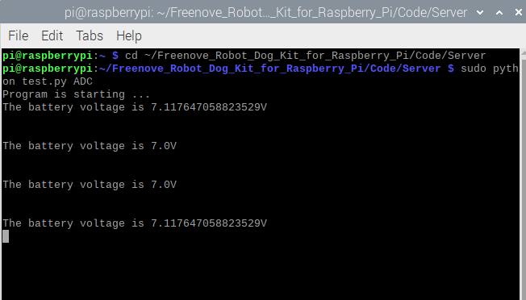
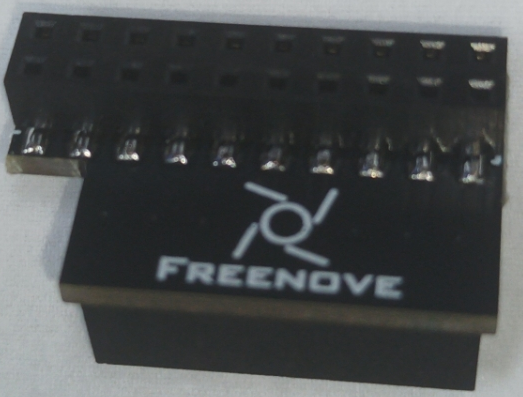

##############################################################################
Chapter 3 Module test (Required)
##############################################################################

**If you have any concerns, please feel free to contact us at support@freenove.com**

The robot dog has been assembled in the previous chapter. This chapter will test each module of the robot dog. It is a necessary check for later control.

Before starting, please install the battery for the robot dog and :red:`turn on the S1 and S2 switches.` Place the robot dog with the calibration supports on a horizontal table to ensure that the wiring of each servo is correct.

:red:`Please use VNC Viewer to build this robot when you use remote mode to login RPi,` :blue:`or there will be errors. Because other desktop remote doesn't support GUI.`

Servo
****************************************************************

Execute following command to check i2c address.

.. code-block:: console

    $ i2cdetect -y 1

As shown in the figure below, the addresses 0x40, 0X48, and 0X68 corresponds to the PCA9685 chip, ADS7830 chip, and MPU6050 module, respectively.

Run program
================================================================

Enter following commands in the terminal to test servos.

If the terminal displays the directory as below (where test.py is located). You can directly execute the test.py command. 

.. image:: ../_static/imgs/Chapter_3_Module_test/Chapter3_01.png
    :align: center

1.	If not, execute the cd command:

.. code-block:: console

    $ cd ~/Freenove_Robot_Dog_Kit_for_Raspberry_Pi/Code/Server

2.	Execute test.py command:

.. code-block:: console

    $ sudo python test.py Servo

Result 
================================================================

After assembly in the previous chapter, the robot should look as shown in picture A. 

After servo test program is executed, the robot's posture will change to A, B, C, D gradually, which indicates the servo channel works normally.

If the situation is not correct, check the servo :ref:`wiring`. 

Code
================================================================

The code is as below:

.. literalinclude:: ../../../freenove_Kit/Code/Server/test.py
    :linenos: 
    :language: python
    :lines: 43-67

Reference
================================================================

.. py:function:: setServoAngle(channel, angle)

    This function has two parameters to control the Servo of the corresponding channel to the corresponding angle.
    
    The first parameter indicates the servo channel

    The second parameter is the rotation angle

    Example:

    setServoAngle (0,60) The Servo of channel 0 is turned to 60 degrees

    setServoAngle (15,160) The Servo of channel 15 is turned to 160 degrees

ADC Module
****************************************************************

Run program
================================================================

Enter following commands to test ADC module.

If the terminal displays the directory as below (where test.py is located). You can directly execute the second command test.py. 

.. image:: ../_static/imgs/Chapter_3_Module_test/Chapter3_04.png
    :align: center

1. If not, execute the cd command:

.. code-block:: console

    $ cd ~/Freenove_Robot_Dog_Kit_for_Raspberry_Pi/Code/Server

2. Execute test.py command:

.. code-block:: console

    $ sudo python test.py ADC

Result
================================================================

Print voltage value of batteries per second. You can press "Ctrl + C" to end the program. 

Code
================================================================

The code is as below:

.. literalinclude:: ../../../freenove_Kit/Code/Server/test.py
    :linenos: 
    :language: python
    :lines: 70-80

Reference
================================================================

.. py:function:: readAdc (channel)

    This function has one parameter for reading the ADC value of the corresponding channel.

    For example:
    
    readAdc (0)
    
    Read the ADC value of the batteries voltage. The returned number ranges between 0-255. Divide the obtained value by 255.0 and then multiply by the reference voltage of 5.0V, and then triple the value to get the batteries voltage. 

Ultrasonic module
****************************************************************

Run program
================================================================

If the terminal displays the directory as below (where test.py is located). You can directly execute the test.py command. 

1.	If not, execute the cd command:

.. code-block:: console

    $ cd ~/Freenove_Robot_Dog_Kit_for_Raspberry_Pi/Code/Server

2.	Execute test.py command:

.. code-block:: console

    $ sudo python test.py Ultrasonic

Result 
================================================================

Every 1s, the distance between the obstacle and the ultrasonic module will be printed in, and you can press "Ctrl + C" to end the program.

Code
================================================================

The code is as below:

.. literalinclude:: ../../../freenove_Kit/Code/Server/test.py
    :linenos: 
    :language: python
    :lines: 32-41

Reference
================================================================

.. py:function:: getDistance()

    This function is used to obtain the distance between ultrasonic module and the obstacle in front of it in centimeters.

LED
****************************************************************

There is an RGB LED module on the robot as below:

Run program
================================================================

Enter the following commands to test LED.

If the terminal displays the directory as below (where test.py is located). You can directly execute the test.py command. 

.. image:: ../_static/imgs/Chapter_3_Module_test/Chapter3_09.png
    :align: center

1.If not, execute the cd command:
.. code-block:: console

    $ cd ~/Freenove_Robot_Dog_Kit_for_Raspberry_Pi/Code/Server

2.Execute test.py command:

.. code-block:: console

    $ sudo python test.py Led

If you are using the Led feature for the first time, it will ask for the PCB version of the connection board.

.. image:: ../_static/imgs/Chapter_3_Module_test/Chapter3_10.png
    :align: center

Please enter 1 or 2 according to the version number of your connection board.

.. list-table:: 
    :width: 100%
    :widths: 50 50
    :align: center

    *   -   Connection board (PCB_V1.0)  
        -   Connection board (PCB_V2.0)

    *   -   |List17|
        -   |List18|

.. |List17| image:: ../_static/imgs/List/List17.png

    

:red:`If your connection board version is V2.0 and you do not have the SPI feature turned on, the LedPixel will not show the color. Refer here to turn on the SPI.`

Result
================================================================

The LED module will show red, green, blue and white in turn. Then all LED are turned OFF.

You can end the program ahead of time by pressing "ctrl+c". 

Code
================================================================

The code of test.py is as below:

.. literalinclude:: ../../../freenove_Kit/Code/Server/test.py
    :linenos: 
    :language: python
    :lines: 4-30

Buzzer
****************************************************************

Run the program
================================================================

Enter following command in the terminal to test buzzer.

If the terminal displays the directory as below (where test.py is located). You can directly execute the test.py command. 

.. image:: ../_static/imgs/Chapter_3_Module_test/Chapter3_12.png
    :align: center

1.If not, execute the cd command:

.. code-block:: console

    $ cd ~/Freenove_Robot_Dog_Kit_for_Raspberry_Pi/Code/Server

2.Execute test.py command:

.. code-block:: console

    $ sudo python test.py Buzzer

Result
================================================================

The buzzer will be turned ON lasting for 3s. Then the program will automatically end or you can press "Ctrl + C" to end the program.

Code
================================================================

.. literalinclude:: ../../../freenove_Kit/Code/Server/test.py
    :linenos: 
    :language: python
    :lines: 82-97

Reference
================================================================

.. py:function:: buzzer.run(cmd)

    This function has one input parameter. If the input is '1', the buzzer will be turned on. If the input is '0', the buzzer will be turned off. 

Camera
****************************************************************

There are two ways to drive the camera.

First method, use the system's default camera detection function.

1.	Open the config.txt file.

.. code-block:: console

    $ sudo nano /boot/firmware/config.txt

2.	Enable the automatic camera detection function.

.. code-block:: python

    camera_auto_detect=1

Second method, manually configure the camera.

1.	Disable the automatic camera detection function.

.. code-block:: python
    
    camera_auto_detect=0

2.	Add the following instruction at the very bottom.

If you are a Raspberry PI 5, add the following command.

.. code-block:: python

    dtoverlay = ov5647,cam0

If you are not a Raspberry PI 5, add the following command.

.. code-block:: python
    
    dtoverlay = ov5647

3.	Save the file and exit, then restart the Raspberry PI.

Run program
================================================================

1.	execute the cd command:

.. code-block:: console

    $ cd ~/Freenove_Robot_Dog_Kit_for_Raspberry_Pi/Code/Server

2.	Execute command below:

.. code-block:: console

    $ python camera.py

Then please open and check the generated image.jpg under

/Freenove_Robot_Dog_Kit_for_Raspberry_Pi/Code/Server. 

Then please open and check the generated image.jpg under

/Freenove_Robot_Dog_Kit_for_Raspberry_Pi/Code/Server. 

