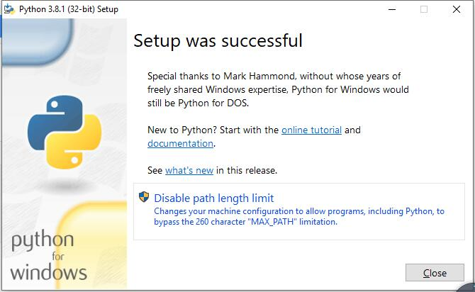
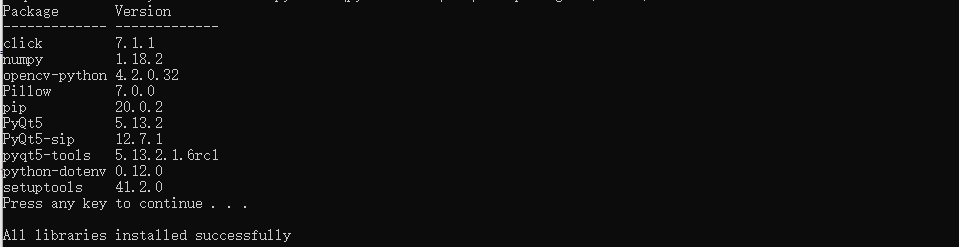
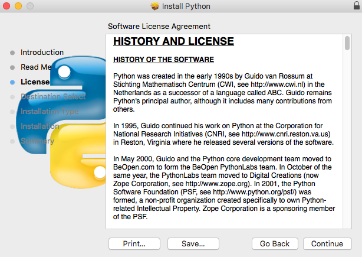
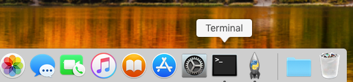

##############################################################################
Chapter 4 Robot Dog
##############################################################################

**If you have any concerns, please feel free to contact us at support@freenove.com**

This robot has rich functions, such as real-time video, LED, ultrasonic ranging. The server and client are established, based on Python3 and PyQt5. They communicate via TCP/IP protocol. The robot can be controlled remotely within a local area network (LAN).

.. _Server:

Server
****************************************************************

The server runs on the Raspberry Pi. It sends the camera data and ultrasonic module data to the client, and receive commands from client.

**The code in the Server folder is used as an example, or if you has a Raspberry Pi5, refer to the code in the server-PI5 folder.**

Code
================================================================

Part of server code is as below:

.. literalinclude:: ../../../freenove_Kit/Code/Server/Server.py
    :linenos: 
    :language: python
    :lines: 45-72

Reference
================================================================

For more code details, please open “Server.py” in Server folder to check.

.. py:function:: get_interface_ip()

    This function can get the IP address of WLAN0 of the Raspberry Pi.

.. py:function:: turn_on_server()

    This function is used to open TCP and wait for a client connection. The channel of port 5000 is mainly used to send and receive commands between the client and server. The channel of port 8000 is used to send video data to the client.

.. py:function:: turn_off_server()

    This function is used to close TCP.

.. py:function:: send_data()

    This function is used to send commands to the client.

.. py:function:: reset_serve()

    This function is used to close TCP and restart.

.. py:function:: transmission_video()

    This function is used to transmit video data to the client.

.. py:function:: receive_instruction()

    This function is used to receive commands from the client

.. _Turn on the server:

Open Server
================================================================

Step 1 Login Raspberry Pi via VNC viewer 
----------------------------------------------------------------

:red:`Because server and client use GUI. You need use VNC viewer as remote desktop way.`

Download and install VNC Viewer according to your computer system by clicking following link:

https://www.realvnc.com/en/connect/download/viewer/

After installation is completed, open VNC Viewer. And click File -> New Connection. Then the interface is shown below. 

.. image:: ../_static/imgs/Chapter_4_Robot_Dog/Chapter4_01.png
    :align: center

 
Enter IP address of your Raspberry Pi and fill in a Name. And click OK.

Then on the VNC Viewer panel, double-click new connection you just created, and the following dialog box pops up. Enter username: :blue:`pi` and Password: :blue:`raspberry`. And click OK.     

.. image:: ../_static/imgs/Chapter_4_Robot_Dog/Chapter4_02.png
    :align: center

|

:red:`If the resolution ratio is not great or there is just a little window, you can set a proper resolution ratio via steps below.`

Select Screen Configuration. Select the appropriate resolution in the new window. Click Apply. 

In addition, your VNC Viewer window may zoom your Raspberry Pi desktop. You can change it. On your VNC View control panel, click right key. And select Properties->Options label->Scaling. Then set proper scaling. 

Step 2 Run commands
----------------------------------------------------------------

Enter following command in the terminal.

1.	Use cd command to enter directory where main.py is located:

.. code-block:: console

    $ cd ~/Freenove_Robot_Dog_Kit_for_Raspberry_Pi/Code/Server

2.	Run main.py:

.. code-block:: console

    $ sudo python main.py

The interface is as below:

You will see your server address (Raspberry Pi IP), Which is the LAN IP address of your Raspberry Pi. In the next chapter, you will need to enter this IP address to connect the Raspberry Pi client with the server. 

The robot will start from this posture. We define it as Relax mode. It will also be referenced later.

If you don't like the interface, you can also enter the commands to open the server. It is more convenient.

1.	Use cd command to enter directory where main.py is located:

.. code-block:: console

    $ cd ~/Freenove_Robot_Dog_Kit_for_Raspberry_Pi/Code/Server

2.	Run main.py:

.. code-block:: console

    $ sudo python main.py -t -n

or Run main,py with following command:

.. code-block:: console

    $ sudo python main.py -tn

"-t" means open TCP communication. "-n" means don't show interface.

Sever Auto Start 
----------------------------------------------------------------

1	Open the terminal and execute the following two commands respectively to create a “start.sh” file.

.. code-block:: shell

    cd ~
    sudo touch start.sh

2	Open “start.sh”.

.. code-block:: shell

    sudo nano start.sh

3	Add the following contents to “start.sh” file.

.. code-block:: shell

    #!/bin/sh
    cd "/home/pi/Freenove_Robot_Dog_Kit_for_Raspberry_Pi/Code/Server"
    pwd
    sleep 10
    sudo cp point.txt /home/pi
    sudo python main.py

Note that if you are a Raspberry PI 5, use the following contents.

.. code-block:: shell

    #!/bin/sh
    cd "/home/pi/Freenove_Robot_Dog_Kit_for_Raspberry_Pi/Code/Server-Pi5"
    pwd	
    sleep 10
    sudo python main.py

Press Ctrl + O and then press Enter to save it. Press Ctrl+X to exit.

4	Modify permissions.  

.. code-block:: shell
    
    sudo chmod 777 start.sh

5	Enter the following command to create a directory.

.. code-block:: shell
    
    mkdir ~/.config/autostart/

6	create and open “start.desktop” file

.. code-block:: shell
    
    sudo nano .config/autostart/start.desktop

7	Add the following content to “start.desktop” file.

.. code-block:: shell

    [Desktop Entry]
    Type=Application
    Name=start
    NoDisplay=true
    Exec=/home/pi/start.sh
    Press Ctrl + O and then press Enter to save it. Press Ctrl+X to exit.

8	Modify permissions.  

.. code-block:: shell
    
    sudo chmod +x .config/autostart/start.desktop

9	Finally enter the following content to reboot Raspberry Pi.

.. code-block:: shell
    
    sudo reboot

.. note::
    
    To cancel auto start, please delete the files “start.sh” and “start.desktop” created above.

Client
****************************************************************

The client can receive video data and commands from the server, and can send commands to the server. And it can run on different systems, such as windows, macOS and so on. However, you need to install related software and libraries when running it.

Part of client code is as below:

.. literalinclude:: ../../../freenove_Kit/Code/Client/Client.py
    :linenos: 
    :language: python
    :lines: 24-35, 99-122

Reference
================================================================

For more code details, please open “Client.py” in Client folder to check.

.. py:function:: turn_on_client ()

    This function is used to connect client to the server.

.. py:function:: turn_off_client ()

    This function is used to disconnect from the server.

.. py:function:: receiving_video()

    This function is used to receive video data sent from the server.

.. py:function:: is_valid_image_4_bytes ()

    This function is used to check whether each frame of video data is complete.

.. py:function:: Looking_for_the_ball ()
    
    This function is used to find the small ball in the video image.

.. py:function:: send_data ()

    This function is used to send commands to the server.

.. py:function:: receive_data ()

    This function is used to receive commands from the server.

Run Client on Windows system
================================================================

There are two ways to run Client on Windows.

Option 1 Running executable file directly
----------------------------------------------------------------

Find the “Client.exe” file in the specified directory, double click it and the Client is opened.

|

.. image:: ../_static/imgs/Chapter_4_Robot_Dog/Chapter4_11.png
    :align: center

After the client is successfully opened, 

1.You need to open the Raspberry Pi and :ref:`Turn on the server`, 

2.Enter the Raspberry Pi's IP address in the white IP edit box, 

3.Click "Connect" to connect client to the Raspberry Pi. 

After the connection is successful, you need to calibrate the robot in Calibration:ref:`Calibration` section. After the calibration is completed, the robot dog can be controlled to move.

You can refer to this video: https://youtu.be/l2v9PdwQdvY

.. raw:: html

   <iframe height="500" width="690" src="https://www.youtube.com/embed/l2v9PdwQdvY" frameborder="0" allowfullscreen></iframe>

.. note::
    
    :red:`when Raspberry Pi is shut down, server will be closed. You need open server again the next time.`

Option 2 Install python3 and some related python libraries to run client
--------------------------------------------------------------------------

If you want to modify the client, you can follow this section. 

This section will be completed in your **computer with windows system**, :red:`not Raspberry Pi.`

To run the client on a Windows system, you need to install some software and libraries, which takes some time. During this process, it does not need to run a server and a Raspberry Pi. You can turn off the Raspberry Pi first. After the installation is completed, turn on the Raspberry Pi and the server.

Install python3
^^^^^^^^^^^^^^^^^^^^^^^^^^^^^^^^^^^^^^^^^^^^^^^^^^^^^^^^^^^^^^^^

Download the installation file via the below link:

https://www.python.org/downloads/windows/

.. image:: ../_static/imgs/Chapter_4_Robot_Dog/Chapter4_12.png
    :align: center

Click Latest Python 3 Release - Python 3.8.1 (as an example).

Choose “Windows x86-64 executable installer” to download and install.

.. image:: ../_static/imgs/Chapter_4_Robot_Dog/Chapter4_14.png
    :align: center

Select “Add Python 3.8 to PATH”. And choose Customize installation.

.. image:: ../_static/imgs/Chapter_4_Robot_Dog/Chapter4_15.png
    :align: center

Select all options and click Next.

.. image:: ../_static/imgs/Chapter_4_Robot_Dog/Chapter4_16.png
    :align: center

Here python is installed into D disk as an example (You can choose your own installation path). Click Install.

.. image:: ../_static/imgs/Chapter_4_Robot_Dog/Chapter4_17.png
    :align: center

Wait for installation.

Installation is successful.

Install PyQt5, opencv, numpy and other libraries
^^^^^^^^^^^^^^^^^^^^^^^^^^^^^^^^^^^^^^^^^^^^^^^^^^^^^^^^^^^^^^^^

If you have not download the zip file, download it via below link:

https://github.com/Freenove/Freenove_Robot_Dog_Kit_for_Raspberry_Pi/archive/master.zip

Then unzip it and delete "-master" to rename it to "Freenove_Robot_Dog_Kit_for_Raspberry_Pi".

Then put it into D disk, for example.

You can also place it into other disks (like E), but the path in following command should be modified accordingly (replace D: by E:).

Press “win + R” and enter cmd, and click ok. Then enter following commands.

1. Enter D disk. If you put it into E, it should be E:

.. code-block:: console

    D:

2. Enter directory where setup_windows.py is located:     

.. code-block:: console

    cd D:\Freenove_Robot_Dog_Kit_for_Raspberry_Pi\Code

3. Run: setup_windows.py

.. code-block:: console

    Python setup_windows.py
 
Or double-click "setup_windows.py" to execute the installation program, under following path:

**Freenove_Robot_Dog_Kit_for_Raspberry_Pi\Code\** 

Or use python3 to run "setup_windows.py".

:red:`Note: If the default python in your windows system is not python3 but python2, then change all "python" in "setup_windows.py" to "python3" and run the command "setup_windows.py" as shown below.`

.. code-block:: console

    Python3 setup_windows.py

Installation takes some time, please be patient. If all installations are successful, it will prompt “Press any key to continue…” and "All libraries installed successfully".

If some libraries are not installed successfully, it will prompt "Some libraries have not been installed yet. Please run 'python setup_windows.py' again". Then you need to execute the python3 setup_windows.py command again. Most installation failures are caused by a poor network. You can check the network before installing.

Open client
^^^^^^^^^^^^^^^^^^^^^^^^^^^^^^^^^^^^^^^^^^^^^^^^^^^^^^^^^^^^^^^^

Press “win + R” and enter cmd, and click ok. Then enter following commands.

1.Enter D disk. If you put it into E, it should be E:

.. code-block:: console

    D:

2.Enter directory where Main.py is located:

.. code-block:: console

    cd D:\Freenove_Robot_Dog_Kit_for_Raspberry_Pi\Code\Client

3.Run Main.py:

.. code-block:: console

    Python Main.py

Or double-click "Main.py". under following path:

**Freenove_Robot_Dog_Kit_for_Raspberry_Pi\Code\Client**

Or use python3 to run "Main.py".

:red:`Note: If the default python in your windows system is not python3, then change the command to run Main.py as shown below.`

.. code-block:: console

    Python3 Main.py

The client interface is shown below:

After the client is successfully opened, 

1.You need to open the Raspberry Pi and :ref:`Turn on the server`,

2.Enter the Raspberry Pi's IP address in the white IP edit box, 

3.Click "**Connect**" to connect client to the Raspberry Pi. 

After the connection is successful, you need to calibrate the robot in :ref:`Calibration` section. After the calibration is completed, the robot dog can be controlled to move.

.. note::
    
    :red:`when Raspberry Pi is shut down, server will be closed. You need open server again the next time.`

Run Client on macOS system
================================================================

Here take MacOS 10.13 as an example. To run the client on MacOS, you need to install some software and libraries. During the installation, it does not need to run a server and use a Raspberry Pi. You can turn off the Raspberry Pi first. After the installation is completed, turn on the Raspberry Pi and run the server. MacOS 10.13 comes with python2, but no python3. The programs of this robot can only run on python3.

Install python3
----------------------------------------------------------------

Download installer, link https://www.python.org/downloads/

.. image:: ../_static/imgs/Chapter_4_Robot_Dog/Chapter4_23.png
    :align: center

Click Python 3.8.2.

:x-large:`If your macOS is 11. Like 11.0, please install python 3.9.` 

:x-large:`If your macOS is NOT 11, like 10.15, please install python 3.8. If you have installed python 3.9. You need uninstall it first.`

.. image:: ../_static/imgs/Chapter_4_Robot_Dog/Chapter4_24.png
    :align: center

On the bottom of the page, click macOS 64-bit installer to download installer.

Then install python.

.. image:: ../_static/imgs/Chapter_4_Robot_Dog/Chapter4_25.png
    :align: center

Click Continue.

Click Continue.

Click Agree.

.. image:: ../_static/imgs/Chapter_4_Robot_Dog/Chapter4_28.png
    :align: center

Click Install. If your computer has a password, enter the password and click Install Software.

.. image:: ../_static/imgs/Chapter_4_Robot_Dog/Chapter4_29.png
    :align: center

Now the installation is completed successfully.

.. image:: ../_static/imgs/Chapter_4_Robot_Dog/Chapter4_30.png
    :align: center

You can find in Applications.

Install PyQt5、opencv、numpy and other libraries
----------------------------------------------------------------

If there is no robot dog code in your macOS, you can download it via link below:

https://github.com/Freenove/Freenove_Robot_Dog_Kit_for_Raspberry_Pi/archive/master.zip

After downloading successfully, you can find it under “Downloads”.

Open “Terminal”.

Type following command in Terminal.

1.	Enter “Downloads” where the code is located. If your path is different, please modify the command.

.. code-block:: console

    $ cd Downloads

2.	Enter directory where setup_macos.py is located:

.. code-block:: console

    $ cd Freenove_Robot_Dog_Kit_for_Raspberry_Pi/Code/

3.	Run setup_macos.py:

.. code-block:: console

    $ python3 setup_macos.py
    
Installation takes some time, please wait patiently. 

If some libraries are not installed successfully, it will prompt "Some libraries have not been installed yet. Please run 'python3 setup_windows.py' again". Then you need to execute the python3 setup_windows.py command again. Most installation failures are caused by a poor network. You can check the network before installing.

If you are using :blue:`macOS under 11.0, like 10.15`. Just skip to “Open client”. 

If you are using :blue:`macOS 11.0 or later version`. Please run commands below:

.. code-block:: console

    $ pip3 uninstall PyQt5
    $ pip3 install PyQt5

Open client
----------------------------------------------------------------

After installation is completed in previous step, now it is in the directory that setup_macos.py is located.

1.	Type following command to enter where the program is located.

.. code-block:: console

    $ cd Client/

2.	Type following command to run the program.

.. code-block:: console

    $ python3 Main.py

.. image:: ../_static/imgs/Chapter_4_Robot_Dog/Chapter4_34.png
    :align: center

After the client is successfully opened, 

1.You need to open the Raspberry Pi and :ref:`Turn on the server`, 

2.Enter the Raspberry Pi's IP address in the white IP edit box, 

3.Click "Connect" to connect client to the Raspberry Pi. 

Then you need calibrate the robot in the Calibration section. After the :ref:`calibration` is completed, robot dog can be controlled to move.

.. note::
    
    :red:`when Raspberry Pi is shut down, server will be closed. You need open server again the next time.`

Run client on Raspberry Pi(Linux) system
================================================================

Install openCv library
----------------------------------------------------------------

Execute following 3 commands in turn.

.. code-block:: console

    $ sudo apt-get install -y libopencv-dev python3-opencv
    $ sudo pip3 install opencv-contrib-python
    $ sudo apt-get install -y libatlas-base-dev libjasper-dev

Open client
----------------------------------------------------------------

Enter the following commands at the terminal.

1.	Use the cd command to go to the directory where Main.py is located.

.. code-block:: console

    $ cd ~/Freenove_Robot_Dog_Kit_for_Raspberry_Pi/Code/Client

2.	Run Main.py:

.. code-block:: console

    $ sudo python Main.py

The interface is shown below. The face recognition cannot work well because it need more computing power than Raspberry Pi has.

After the client is successfully opened, 

1.You need to open the Raspberry Pi and :ref:`Turn on the server`, 

2.Enter the Raspberry Pi's IP address in the white IP edit box, 

3.Click "Connect" to connect client to the Raspberry Pi. 

After the connection is successful, you need to calibrate the four legs of the robot dog in :ref:`calibration` section. After the calibration is completed, the robot dog can be controlled to move.

.. note::
    
    :red:`when Raspberry Pi is shut down, server will be closed. You need open server again the next time.`

.. _calibration:

Calibration
================================================================

You can refer to this video: https://youtu.be/lv9PdwQdvY2

.. raw:: html

   <iframe height="500" width="690" src="https://www.youtube.com/embed/lv9PdwQdvY2" frameborder="0" allowfullscreen></iframe>

Calibrate the robot.

1.	Lay the calibration paper on a horizontal hard table.

2.	Install the calibration supports on the robot dog and place it on the corresponding position on the calibration paper. 

3.	Connect client with server successfully, click the "Calibration" button on the client, then a calibration window pops up. And the robot's legs will automatically put to the following position.

4.	Calibrate the four legs to make 4 foot points fall to the corresponding positions. Feel the contact force between the robot dog and the ground during calibration. Future control depends on this step.

5.	After all the 4 points have reached the designated position, click "Save" to save. Now calibration is completed.

.. note:: 

    :red:`1.It is best to have the robot dog walk on a flat hard floor. The robot dog may not walk well on other grounds.`
    
    :red:`2.There is an offset when controlling the robot dog to walk straightly, which is normal. It is caused by the installation error and the error of the servo itself. As a result, the left and right legs cannot be completely symmetrical, and may differ by 1mm or 2mm. As the walking distance accumulates, this error is constantly superimposed. Then there will be a large offset from the original position.`
    
    :red:`3.If the calibration is not good enough, it will affect walking. You can recalibrate the robot with same steps.`

Control
================================================================

After calibrating successfully, you can control the robot dog to move.

.. image:: ../_static/imgs/Chapter_4_Robot_Dog/Chapter4_39.png
    :align: center

**Relax mode:**

a)	When the robot dog moves for 3 minutes at a time, it will feel tired (the servo will get hot).  In order to protect the servo, the robot will get into relax mode for 1 minute. During this time, it won’t respond to any motion command. You can still use the functions of LED, buzzer, real-time video and so on. 

b)	When the robot dog moves for less than3 minutes and rests for 1 minute. The timer will start from 0. Then the robot can move for 3 minutes again.

c)	If the robot isn't tired and is standing, when the robot does not receive motion command for 10s, it will get into relax mode. In this situation, it will respond to all commands.

You can click and drag the cross cursor in the coordinate system to adjust the yaw and pitch angle of body.

The following is the corresponding operation of the buttons and keyboards.

.. list-table:: 
    :width: 100%
    :widths: 50 20 70
    :align: center
    :header-rows: 1

    *   -   Button on Client
        -   Key
        -   Action
    
    *   -   ForWard
        -   W
        -   Move
    
    *   -   BackWard
        -   S
        -   Back off
    
    *   -   Turn Left
        -   A
        -   Turn left
    
    *   -   Turn Right
        -   D
        -   Turn right
    
    *   -   Step Left
        -   Q
        -   Step Left
   
    *   -   Step Right
        -   E
        -   Step Right
   
    *   -   Connect/ Disconnect
        -   C
        -   On/Off Connection
   
    *   -   Open Video/ Close Video
        -   V
        -   On/Off Video
   
    *   -   Calibration
        -   M
        -   Open calibration interface
   
    *   -   Buzzer/Noise
        -   Space
        -   On/Off Buzzer
   
    *   -   Relax
        -   R
        -   Relax station
   
    *   -   LED
        -   L
        -   Open LED control interface
   
    *   -   Sonic
        -   U
        -   Measure and display distance from obstacle
   
    *   -   Balance
        -   B
        -   Open/Close balance modeAction
   
    *   -   Face/Ball/Close
        -   F
        -   Face recognition and ball tracking
    
    *   -   Face ID
        -   
        -   Input images of human faces

Input images of human faces and recognize them.

1.	Click "Face ID". 

2.	Enter name in the box of the pop-up window.

3.	Click "Read Face".

4.	A picture is taken and recorded every two seconds, and a total of 30 images will be taken. **Try to show faces at different distances and angles during the shooting process.** (When the face is not recognized, the picture will not be recorded until the face is recognized again.)

5.	**After the 30 images are recorded, you can close the window** and click "Face" on the Right to identify the face.

.. note::
    
    Do NOT use different names when re-entering images of the same person to avoid client working abnormally.

The function of SliderBar is below:

.. list-table:: 
    :width: 100%
    :widths: 40 70
    :align: center
    :header-rows: 1

    *   -   SliderBar
        -   Function
    
    *   -   Head
        -   Adjust head angle.
    
    *   -   Height
        -   Control body height.
    
    *   -   Horizon
        -   Make body move forward or back.
    
    *   -   Yaw
        -   Adjust Yaw angle of body

    *   -   Pitch
        -   Adjust Pitch angle of body
    
    *   -   Roll
        -   Adjust Roll angle of body

.. note:: 

    If the robot work abnormally, please check following contents.

    1. Check the battery level. Low battery level will make the server shut down.

    2. Check if the wireless connection is disconnected.

    3. Check if the Raspberry Pi is stuck.

    4. If all three points above work well, please restart server and client. If there still is any abnormality, please contact us by email (support@freenove.com). We will help you.

Free your innovation
****************************************************************

**If you have any concerns, please feel free to contact us via support@freenove.com**

If you want to write your own program to control the robot dog, you can follow this chapter.

The robot dog program is based on python3. If your python is python2 by default, please change to python3.

If you have never learned python before, you can learn some basics through the following links:

https://python.swaroopch.com/basics.html

Program
================================================================

First, open Thonny Python IDE which is easy to use for beginners.

Create a new file.

.. image:: ../_static/imgs/Chapter_4_Robot_Dog/Chapter4_44.png
    :align: center

Name it with myCode as an example and save it in Server folder of robot code folder.

Open the Server folder of the robot dog code and you can see the file you created.

Write the code in myCode.py as below and click save after finished, as shown below.

Type the following command to enter the directory where myCode.py is located.

.. code-block:: console

    $ cd ~/Freenove_Robot_Dog_Kit_for_Raspberry_Pi/Code/Server

Run myCode.py

.. code-block:: console

    $ sudo python myCode.py

You can see that your robot dog moves forward for 5 steps, then twists its body at 10 degrees to the right, then 20 degrees to the left, then returns to the original attitude and move forward 5 steps and then stops.

Related py files
================================================================

Some important functions included in the py files are listed below. If you want to see more detailed code content, please open the corresponding py file to check directly.

ADS7830.py

.. list-table:: 
    :width: 100%
    :widths: 40 70
    :align: center
    :header-rows: 1

    *   -   Function
        -   Description
    
    *   -   power(channel)
        -   Enter 0 to return the battery voltage value.
  
Buzzer.py

.. list-table:: 
    :width: 100%
    :widths: 20 70
    :align: center
    :header-rows: 1

    *   -   Function
        -   Description
    
    *   -   run(command)
        -   Enter 0, then the buzzer will not sound. Enter 1, the buzzer will sound.
  
Contorl.py

.. list-table:: 
    :width: 100%
    :widths: 15 70
    :align: center
    :header-rows: 1

    *   -   Function
        -   Description
    
    *   -   coordinateToAngle(x,y,z)
        -   Enter the foot coordinate then return servo angle of each joint 
            
            in one leg.
    
    *   -   angleToCoordinate(a,b,c)
        -   Enter the leg joint angle then return the foot coordinate.
    
    *   -   Condition()
        -   Execute corresponding action commands

    *   -   map()
        -   Mapping a value from one range to another 
    
    *   -   backWard ()
        -   Move backward one step
    
    *   -   forward()
        -   Move forward one step
    
    *   -   turnLeft()
        -   Turn left one step

    *   -   turnRight()
        -   Turn right one step
    
    *   -   stop()
        -   Stop.
    
    *   -   setpLeft()
        -   Move to left one step  
    
    *   -   setpRight()
        -   Move to right one step 

    *   -   upAndDown() 
        -   Adjust height of body
    
    *   -   beforeAndAfter()
        -   Make body move forward or backward
    
    *   -   attitude(r,p,y)
        -   Set roll, pitch, and yaw angle of the robot.
 
IMU.py

.. list-table:: 
    :width: 100%
    :widths: 20 70
    :align: center
    :header-rows: 1

    *   -   Function
        -   Description
    
    *   -   imuUpdate()
        -   Update the current roll, pitch, and yaw angle of the robot.

Led.py

.. list-table:: 
    :width: 100%
    :widths: 20 70
    :align: center
    :header-rows: 1

    *   -   Function
        -   Description
    
    *   -   ledIndex( Index, R, G, B)
        -   Turn on one LED and set color.

    *   -   wheel(pos)
        -   Create different RGB values.
    
    *   -   LED_TYPR(order,R_G_B)
        -   Change the order in which the LED color data is transmitted. 
            
            When the value of the order parameter is "RGB", the order of
            
            data transmission should be: R-G-B; when the value of the order 
            
            parameter is "GBR", and the order of data transmission should 
            
            be: G-B-R

    *   -   theaterChaseRainbow
     
            (strip, wait_ms)
        -   The function is used to make 7 LEDs show one color at the same 
            
            time, and change various colors to blink. The blinking interval 
            
            is wait_ms, and the default value is 50ms
    
    *   -   rainbow(strip, wait_ms)
        -   This function achieves the effect of rainbow breathing. It makes
        
            8 LEDs display same color at the same time, and then change all 
            
            various colors like breathing. 

    *   -   rainbowCycle(strip, wait_ms)
        -   This function also achieves the effect of rainbow breathing. 
            
            but unlike rainbow(), it makes eight LEDs to display different 
            
            colors at the same time, and then change various color separately. 
            
            The interval is wait_ms. The default value is 20ms

Servo.py

.. list-table:: 
    :width: 100%
    :widths: 20 70
    :align: center
    :header-rows: 1

    *   -   Function
        -   Description
    
    *   -   setServoAngle(channel, angle)
        -   Turn the servo of the specified channel to specified angle.

Ultrasonic.py

.. list-table:: 
    :width: 100%
    :widths: 20 70
    :align: center
    :header-rows: 1

    *   -   Function
        -   Description
    
    *   -   getDistance()
        -   Obtain the distance between the obstacle in front and the ultrasound.

Custom Action
================================================================

We have also customized some specific actions, such as push-up, greeting, etc. You can run "Action.py" to play.

Android and iOS app
****************************************************************

You can download and install the Freenove Android app from below links:

On Google play:

https://play.google.com/store/apps/details?id=com.freenove.suhayl.Freenove

On GitHub:

https://github.com/Freenove/Freenove_App_for_Android

In this GitHub repository, you can find the App instruction (Tutorial.pdf).

You can download and install the Freenove **iOS app** by searching **freenove** in app store.

**Relax mode**

a)	When the robot dog moves for 3 minutes in total, it will feel tired (the servo will get hot).  In order to protect the servo, the robot will get into relax mode for 1 minute. During this time, it won't respond to motion command. You can still use the functions of LED, buzzer, real-time video and so on. 

b)	When the robot dog moves for <3 minutes and then the robot rest for 1 minute. The timer will start from 0. Then the robot can move for 3 minutes again.

c)	If the robot isn't tired and is standing, when the robot does not receive motion command for 10s, it will get into relax mode. In this situation, it will responds to any commands.

The followings are the features of this app. 

First, you need to turn on the :ref:`Server<Turn on the server>`. Then enter your raspberry pi IP address and click connect icon. 

On the top of the interface, there is a timer slider to indicate the time for moving or resting.

