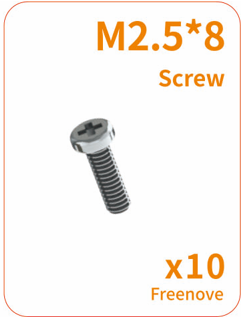
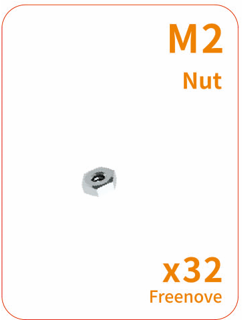
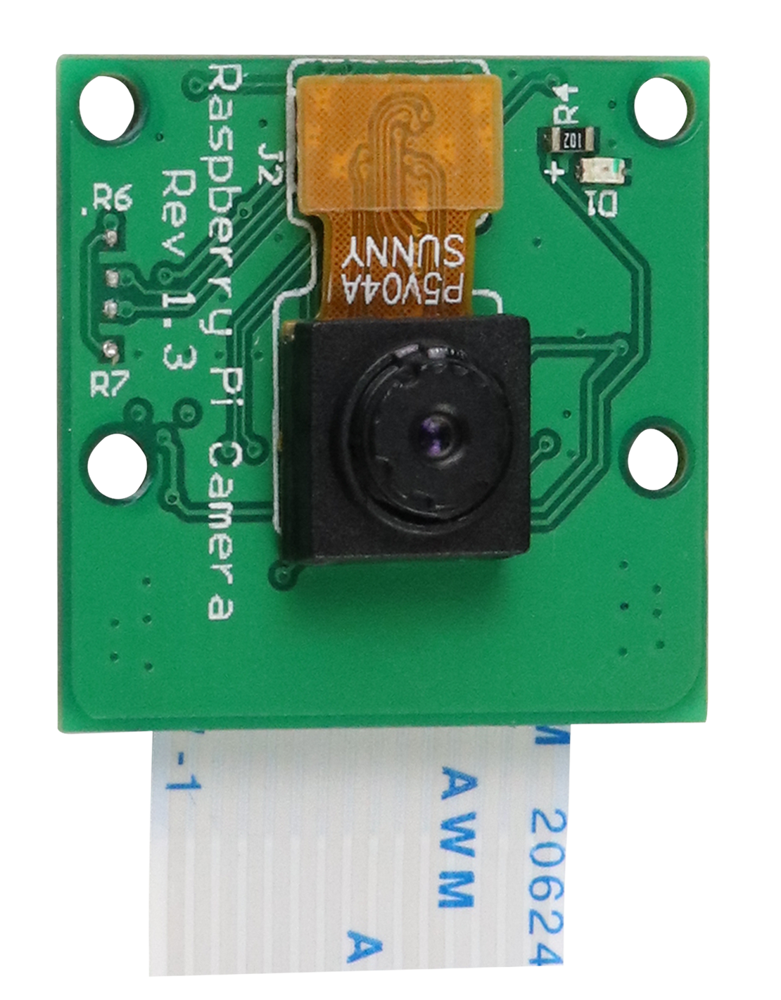

##############################################################################
List
##############################################################################

**If you have any concerns, please feel free to contact us at support@freenove.com**

Robot Shield for Raspberry Pi
****************************************************************

.. list-table:: 
    :width: 60%
    :align: center

    *   -   Top
    *   -   |List00|
    *   -   Bottom
    *   -   |List01|
  

Machinery Parts
****************************************************************

.. list-table:: 
    :width: 100%
    :align: center

    *   -   |List02|
        -   |List03|
        -   |List04|

    *   -   |List05|
        -   |List06|
        -   |List07|

    *   -   |List08|
        -   |List09|
        -   |List10|

.. |List09| image:: ../_static/imgs/List/List09.png

Transmission Parts
****************************************************************

.. list-table:: 
    :width: 100%
    :align: center

    *   -   ES08MA Ⅱservo package x12
        -   S90 servo package x1
    *   -   |List11|
        -   |List12|
  

Acrylic Parts
****************************************************************

.. image:: ../_static/imgs/List/List13.png
    :align: center

Electronic Parts and Tools
****************************************************************

.. note::

  :red:`There are two models of connection boards, remember their version numbers.`

+---------------------------+---------------------------------+--------------------------------+
|  LED module               |  Camera x1                      | HC-SR04 Ultrasonic Module x1   |   
|                           |                                 |                                |   
|    |List14|               |   |List15|                      |   |List16|                     |   
+---------------------------+----------------+----------------+--------------------------------+
|  Connection board (PCB_V1.0)               |   Connection board (PCB_V2.0)                   |   
|                                            |                                                 |   
|    |List17|                                |    |List18|                                     |   
+--------------------------------------------+-------------------------------------------------+
|  Jumper wire F/F(4) for ultrasonic module                                                    |   
|                                                                                              |   
|    |List19|                                                                                  |   
+----------------------------------------------------------------------------------------------+
|  10cm 3Pin LED cable (same direction)                                                        |   
|                                                                                              |   
|    |List20|                                                                                  |   
+----------------------------------------------------------------------------------------------+
|  25cm 15Pin camera cable (reversed direction)                                                |   
|                                                                                              |   
|    |List21|                                                                                  |   
+----------------------------------------------------------------------------------------------+
|  FPC soft line x1                                                                            |   
|                                                                                              |   
|    |List22|                                                                                  |   
|                                                                                              |
|:red:`Please note that this cable only come with the purchase of the Raspberry Pi 5 version.` |
+---------------------------+---------------------------------+--------------------------------+
|Cross screwdriver (3mm) x1 |  Cable tidy x80cm               | Red ball                       |   
|                           |                                 |                                |
|Cross screwdriver (2mm) x1 |                                 |                                |   
|                           |                                 |                                |
|    |List23|               |   |List24|                      |   |List25|                     |   
+---------------------------+---------------------------------+--------------------------------+

.. |List17| image:: ../_static/imgs/List/List17.png
.. |List18| image:: ../_static/imgs/List/List18.png

.. |List24| image:: ../_static/imgs/List/List24.png

Required but NOT Contained Parts
****************************************************************

+-------------------------------------------------------------------------------------------+
| Two 18650 lithium batteries without protected board.                                      | 
|                                                                                           |
| The continuous discharge current >10A                                                     |                                                                                
|                                                                                           |
| It is not easy to find proper batteries on Amazon.                                        |                                                                                        
|                                                                                           |
| Search 18650 3.7V high drain on eBay or other websites.                                   |                                                                                        
|                                                                                           |   
|    |List26|                                                                               |   
+-------------------------------------------------------------------------------------------+
| Raspberry Pi (:red:`Recommended model: Raspberry 5 / 4B / 3B+`) x1                        |   
|                                                                                           |   
|    |List27|                                                                               |   
+-------------------------------------------------------------------------------------------+

.. |List26| image:: ../_static/imgs/List/List26.png
    :width: 50%
